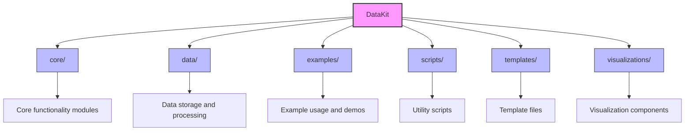

# Project Structure Diagram



## Directory Structure

```
full_datakit/
├── core/           # Core functionality and main logic
├── data/           # Data storage and processing
├── examples/       # Example usage and demos
├── scripts/        # Utility scripts
├── templates/      # Template files
├── visualizations/ # Visualization components
└── datakit.py      # Main package entry point
```

## Key Components

- **core/**: Contains the main business logic and core functionality
- **data/**: Handles data storage, loading, and preprocessing
- **examples/**: Example scripts and notebooks demonstrating usage
- **scripts/**: Utility and helper scripts
- **templates/**: Template files for various use cases
- **visualizations/**: Components for data visualization
- **datakit.py**: Main package entry point and public API
