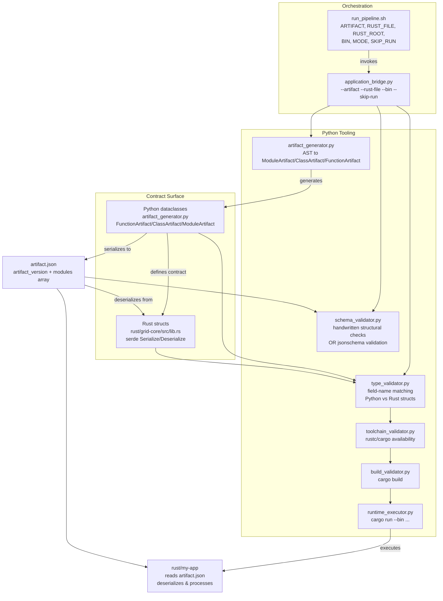
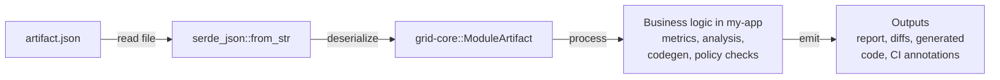
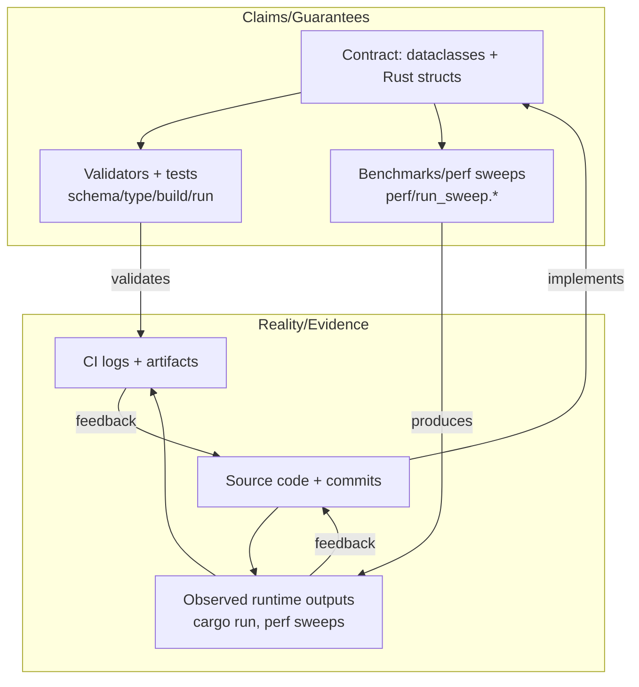

# Architecture Diagrams

This document contains three architecture diagrams that illustrate different aspects of the Python→Rust contract pipeline.

## Diagram 1: Code-Accurate Pipeline (Artifact Contract Mode)

This diagram shows the complete pipeline flow from Python AST parsing through validation to Rust execution.

## Diagram 2: Runtime Consumption Loop

This diagram illustrates how the Rust binary consumes the artifact and produces outputs.

## Diagram 3: Continuous Groundedness Loop

This diagram shows the feedback loop between claims/guarantees and reality/evidence, ensuring continuous validation.

## Key Concepts

### Contract Surface
The contract is defined by:
- **Python dataclasses** in `artifact_generator.py` (source of truth for structure)
- **Rust structs** in `rust/grid-core/src/lib.rs` (must match Python structure)
- **artifact.json** is the wire format (serialized from Python, deserialized by Rust)

### Validation Pipeline
1. **Schema validation**: Ensures JSON structure matches expected format
2. **Type validation**: Ensures Python and Rust field names match
3. **Toolchain validation**: Ensures Rust toolchain is available
4. **Build validation**: Ensures Rust code compiles
5. **Runtime validation**: Ensures Rust binary can execute and process artifacts

### Continuous Groundedness
Every claim about interoperability is backed by:
- An artifact (artifact.json)
- A validator (schema/type/build/run checks)
- Reproducible evidence (CI logs, build outputs)

This ensures that the contract remains valid as the codebase evolves.

